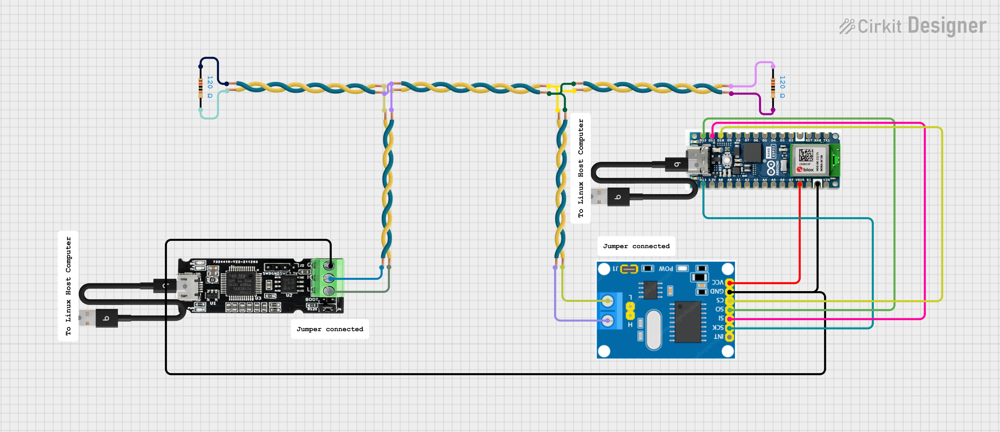

# CAN_bus_test

This is how host linux computer communicate with Ardunino Nano ESP32 via CAN bus.

Hardware
- Arduino Nano ESP32
- USB to CAN module
- MCP2515 from ESP32 to CAN via SPI protocol

## Physical connection




## Step to test send/ receive /transceive to and from Linux host

At Linux host,
step 1. find Can bus port

```
sudo dmesg | grep -i can
```

result

```
can0: slcan on ttyACM1
```

Now I know that ACM1 is the port to CAN, and using Arduino IDE, I can find out that ACM0 is the port to Arduino Nano ESP32.

Step 2. Make a CAN interface

```
sudo slcand -s8 -o /dev/ttyACM1 can0
sudo ip link set can0 up type can bitrate 500000
```

Now that CAN interface on Linux established.

### How to receive data from Linux to Arduino Nano ESP32 via CAN

use esp32_arduino_CAN_test_receive, upload the firmware .ino to Arduino Nano ESP32, turn on the serial monitor.

at Linux host, send CAN package

```
cansend can0 123#DEADBEEF
```
if everything works fine, then on Arduino IDE, you should see

```
ret=0
id=291
len=4
ID = 0x123
Message = DE AD BE EF 
----------------
```
or another way

```
cd send_CAN
g++ send_from_linux.cpp -o send_from_linux
./send_from_linux
```

if everything works fine, then on Arduino IDE, you should see

```
ret=0
id=256
len=4
ID = 0x100
Message = B0 4 9C 4 
----------------
```

### How to send data from Linux to Arduino Nano ESP32 via CAN

Step 1
use esp32_arduino_CAN_test_send, upload the firmware .ino to Arduino Nano ESP32, turn on the serial monitor.

Step 2
Open a terminal on Linux and do candump

```
candump can0
```

if successful you should see from the candump terminal

```
  can0  123   [8]  11 22 33 44 55 66 77 88
  can0  123   [8]  11 22 33 44 55 66 77 88
  can0  123   [8]  11 22 33 44 55 66 77 88
```

### How to transceive data from Linux to Arduino Nano ESP32 via CAN

Step 1
use esp32_arduino_CAN_test_transceive, upload the firmware .ino to Arduino Nano ESP32, turn on the serial monitor.

Step 2
Open a terminal on Linux and do candump

```
candump can0
```

if successful you should see from the candump terminal

```
  can0  123   [8]  11 22 33 44 55 66 77 88
  can0  123   [8]  11 22 33 44 55 66 77 88
  can0  123   [8]  11 22 33 44 55 66 77 88
```

Step 3 
at Linux host, send CAN package

```
cansend can0 123#DEADBEEF
```
if everything works fine, then on Arduino IDE, you should see

```
ret=0
id=291
len=4
ID = 0x123
Message = DE AD BE EF 
----------------
```
or another way

```
cd send_CAN
g++ send_from_linux.cpp -o send_from_linux
./send_from_linux
```

if everything works fine, then on Arduino IDE, you should see

```
ret=0
id=256
len=4
ID = 0x100
Message = B0 4 9C 4 
----------------
```
